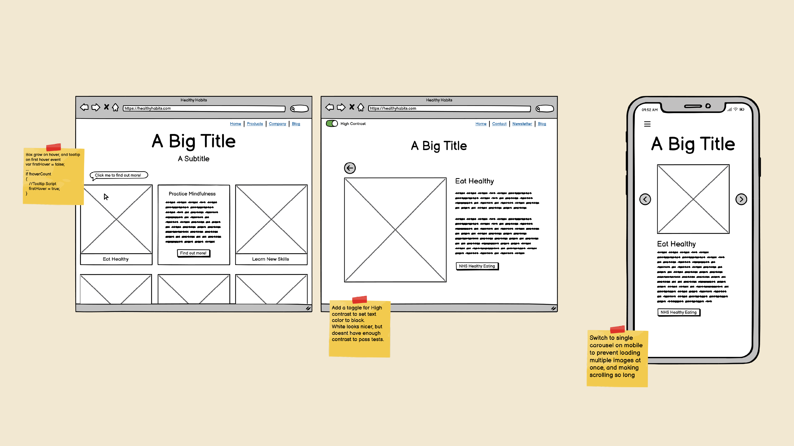
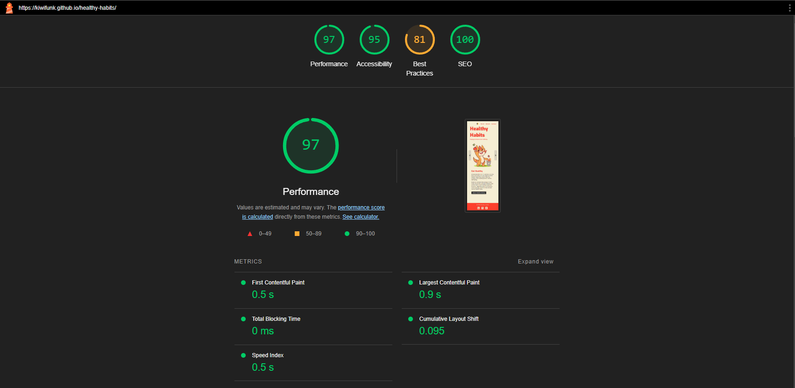

# Healthy Habits
A site promoting healthy habits to better your wellbeing to a variety of ages

## Project Outline

The goal of this project is to give advice and signpost people to topics and pages to help better and improve their mental and physical wellbeing. This is by no means a professional website, but seeks to give advice on simple lifestyle changes that can have wide benefits to wellbeing.

## Wireframes

Wireframes were created in Balsamiq to give an initial idea of the layout. From the start I knew I wanted something that could hold a lot of content, yet didnt have a million pages to tab though or navigate. I also planned from early on to deliver a very different experience for mobile and desktop, as I didnt want the user having an extremely long page to navigate on mobile devices, something that would happen if I simply used flexbox to display every card in a single column.

I also wanted a way to break up all my information so the page was never full of text, This would keep it accessible for kids, and make it less overwhelming for adults that might be going through hard times. Each section of advice is identified with a simple heading, and a friendly image representing the activity. When the card is clicked on, it expands to show a brief blurb about the subject, and a button to link to a more detailed page on the subject, and signposting to services relating to it. For example, NHS support pages. By doing it this way I can also use queries to link to the associated data, instead of having a long dropdown menu, or multiple HTML pages.

## Technical Details

For populating each card and mobile slide with content, I have created a JavaScript class to hold all the relevant information such as headings, image URLs, description, ARIA details etc. These are then stored in an array of classes. This means I don't have to repeat myself in the HTML file for both the mobile and desktop layouts, and makes consistency, making changes, or adding new slides/cards much simpler.

For mobile the placeholder text is replaced with the content of this class, and then the navigation arrows increment or decrement the index, with checks to prevent out of bounds values. With my cards, I have created a function to build the card HTML, using interpolation to add the data from the class where needed. A foreach loop then iterates through the array and creates a card for every entry.

Tooltips have been added on initial page load to prompt the user to click them. I felt that perhaps clicking the card my not be intuitive for a lot of users, so adding a prompt is an easy way to explain this function. Once the card has been clicked the tooltips are hidden, as they are no longer needed.

## Color and Fonts

For my color schemes, I used sites such as Adobe Color to pick out something that looked graphically appealing. I then iterated through colors for my mascot until I settled on something that worked well and also fit with the site design, using the accent color on both the character and the headings of the page. 

For my fonts, I wanted something rounded yet still semi-professional as it is a fairly serious topic, yet I didn't want it to look like a medical journal or NHS page. I then put these together in a simple document to see how they would look together, before going forward with the project.

## Mascot Design

I created some fun mascot characters to represent each different activity. I felt that this provided more charm and made the topic feel less sterile and medical like a lot of the sites on these topics do. I didn't want to downplay the importance of the contents, yet I also didnt want to make it feel so medical. The aim was to try and reach a range of different ages by having something that kids would enjoy, yet wouldnt feel overly childish to the point an older audience would feel insulted. Another concern was having a cartoon character that felt very coorporate and branded. Cartoons such as Bluey seem to balance this fine line well, and for a professional project, I'd most likely hire an illustrator with a lot of experience in this department.

## Page Testing

The overall site performance of my page is good, scoring a 97 on mobile, and a 91 when loading the desktop cards. As mobile is the most important when it comes to performance due to the fact they are more likely to be loading off of a less stable cellular connection I am pretty happy with this. I am using next gen formats such as webp to reduce the amount of data needed, and trying to keep the total amount of large files loaded to a minimum on mobile. If this site were further expanded, I'd probably make sure cards dynamically load to improve loading times.

My accessibility score was almost perfect, but fell short on the contrast. I have addressed this in the next section.

For best practices, I only have one thing dropping my score so low, which is a warning about using 'overflow: visible' as it may cause objects to render out of bounds. This was an intentional design choice, so I will ignore this.

For SEO I made sure that every link had a descriptive name instead of something simple like 'Learn More', and followed best practices such as using meta descriptions, correct header hierarchy and semantic tags to score 100.

To address the 95 I scored in accessibility, I added a high contrast toggle to the Navbar. This sets the accent color to a darker tone, and lightens the background elements to achieve a sufficient contrast ratio across all the criteria. Using session cookies I can make sure the contrast choice remains across all site pages for the duration of the visit.

After re-running the test with high contrast mode enabled, I was now able to finally score a 100 in accessability. I have also run my page through validators, and made any necessary changes