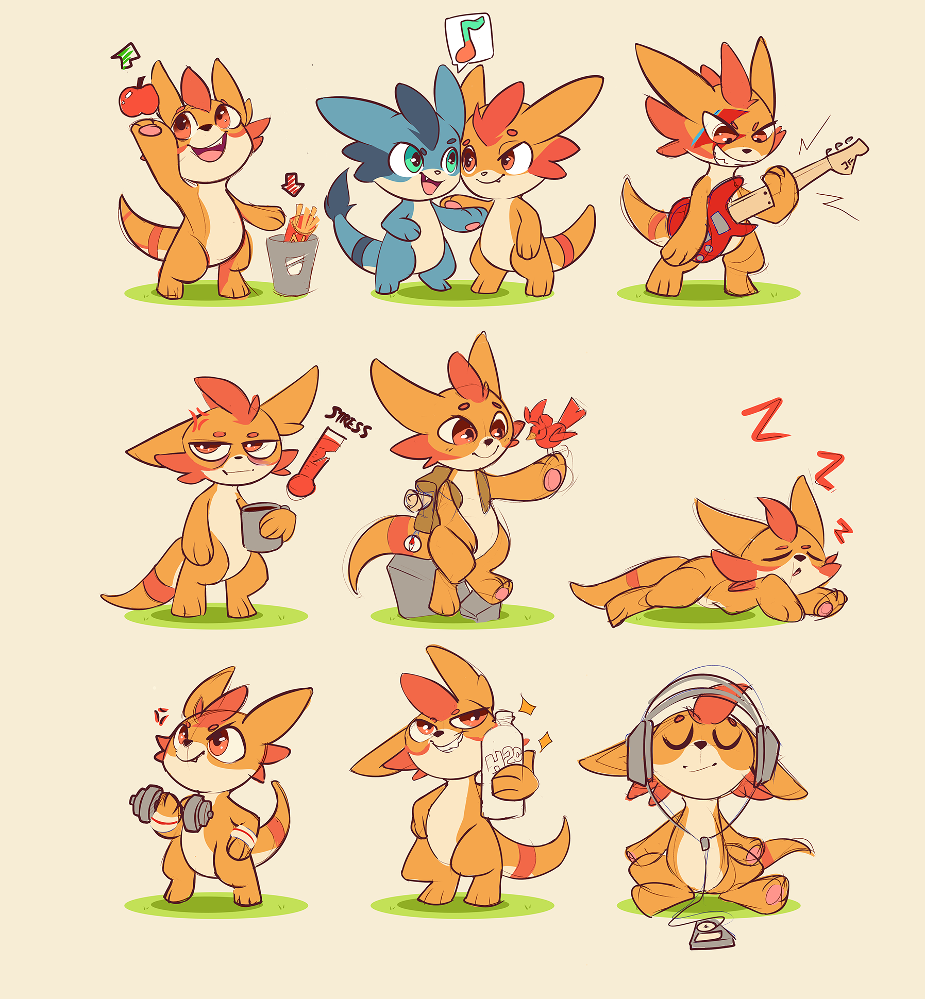

# Healthy Habits
A site promoting healthy habits to better your wellbeing to a variety of ages

## Project Outline

The goal of this project is to give advice and signpost people to topics and pages to help better and improve their mental and physical wellbeing. This is by no means a professional website, but seeks to give advice on simple lifestyle changes that can have wide benefits to wellbeing.

## Wireframes

Wireframes were created in Balsamiq to give an initial idea of the layout. From the start I knew I wanted somethign that could hold a lot of content, yet didnt have a million pages to tab though or navigate. I also planned from early on to deliver a very different experience for mobile and desktop, however this will be a stretch goal due to time constraints.

## Color and Fonts

## Mascot Design

I created some fun mascot characters to represent each different activity. I felt that this provided more charm and made the topic feel less sterile and medical like a lot of the sites on these topics do. I didn't want to downplay the importance of the contents, yet I also didnt want to make it feel so medical. The aim was to try and reach a range of different ages by having something that kids would enjoy, yet wouldnt feel overly childish to the point an older audience would feel insulted. Another concern was having a cartoon character that felt very coorporate and branded. Cartoons such as Bluey seem to balance this fine line well, and for a professional project, I'd most likely hire an illustrator with a lot of experience in this department.

